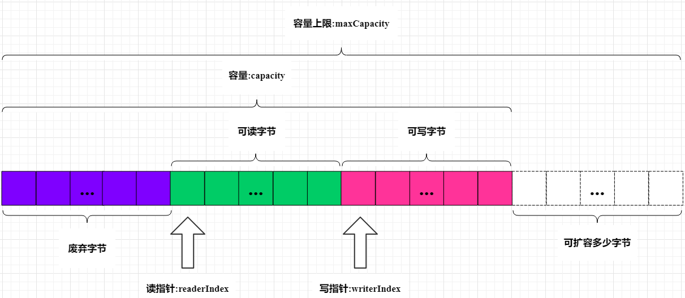

# mio

## 1 Netty
### 1.1 采坑记录
**① Netty服务端启动后无异常自动退出**

bind().sync()成功后需要手动调用channelFuture.channel().sync()进行hold。

**② 禁止采用BIO模式调用NIO通讯框架**

可能会发生大量创建EventLoopGroup线程池导致OOM。禁止循环创建EventLoopGroup，即1个TCP连接对应1个NIO线程池，不仅没优化效
果，还可能发生OOM。建议循环创建connect(),而不是循环创建EventLoopGroup线程池。

**注意**：Bootstrap自身不是线程安全的，但执行Bootstrap的连接操作是串行执行的。connect方法它会创建一个新的NioSocketChannel，并从初
始构造的EventLoopGroup中选择一个NioEventLoop线程执行真正的Channel连接操作，与执行Bootstrap的线程无关。在同一个Bootstrap
创建多个客户端连接，EventLoopGroup是共享的，这些连接共用同一个NIO线程组EventLoopGroup。

**③ 链路异常只需关闭并释放Channel即可**

当某个链路发生异常或关闭时，只需要关闭并释放Channel本身即可，不能同时销毁NioEventLoop和所在线程组EventLoopGroup。

**④ 建议使用PooledByteBufAllocator成为默认的Allocator**

有性能测试表明：采用内存池的ByteBuf相比于朝生夕灭的ByteBuf，性能高23倍左右（性能数据与使用场景强相关）。

**⑤ ByteBuf释放策略**
- 基于内存池的请求ByteBuf，这类主要包括PooledDirectByteBuf和PooledHeapByteBuf，它由NioEventLoop线程在处理Channel读操作时分配，
需要在业务ChannelInboundHandler处理完请求消息后释放(通常在解码之后)，它的释放策略如下：
a.ChannelInboundHandler继承自SimpleChannelInboundHandler，实现它的抽象方法channelRead0，ByteBuf的释放业务不用关心，由SimpleChannelInboundHandler负责释放
b.在业务ChannelInboundHandler中调用ctx.fireChannelRead(msg)，让请求继续向后执行，直至调用DefaultChannelPipeline的内部类TailContext，由它负责释放请求信息
c.直接调用在channelRead方法里调用ReferenceCountUtil.release(reqMsg)
- 基于非内存池的请求ByteBuf,它也是需要按照内存池的方式释放内存
- 基于内存池的响应ByteBuf，根据之前的分析，只要调用了writeAndFlush或flush方法，在消息发送完成后都会由Netty框架进行内存释放，业务不需要主动释放内存
- 基于非内存池的响应ByteBuf，业务不需要主动释放内存

**⑥ 内存泄漏检测**

Netty提供了内存泄漏的监测机制,JVM启动时通过-D的方式加入 `-Dio.netty.leakDetectionLevel=advanced` 进行启用。
默认会从分配的ByteBuf里抽样出大约1%的来进行跟踪。如果泄漏，会有如下语句打印：

```
LEAK: ByteBuf.release() was not called before it's garbage-collected. Enable advanced leak reporting to find out where the leak occurred. 
To enable advanced leak reporting, specify the JVM option '-Dio.netty.leakDetectionLevel=advanced' or call ResourceLeakDetector.setLevel()
```

四种防漏等级如下：
- **禁用(DISABLED)**：完全禁止泄露检测，省点消耗
- **简单(SIMPLE)**：默认等级，告诉我们取样的1%的ByteBuf是否发生了泄露，但总共一次只打印一次，看不到就没有了
- **高级(ADVANCED)**：告诉我们取样的1%的ByteBuf发生泄露的地方。每种类型的泄漏（创建的地方与访问路径一致）只打印一次。对性能有影响
- **偏执(PARANOID)**：跟高级选项类似，但此选项检测所有ByteBuf，而不仅仅是取样的那1%。对性能有绝大的影响

**⑦ Netty发送队列积压导致内存泄漏**
https://blog.51cto.com/14478380/2425450


### 1.2 ByteBuf
**① ByteBuf数据结构**


Netty里有4种主力的ByteBuf，其中:

- **UnpooledHeapByteBuf**：底下的byte[]能够依赖JVM GC自然回收
- **UnpooledDirectByteBuf**：底下是DirectByteBuffer，是Java堆外内存，除了等JVM GC，最好也能主动进行回收，否则导致内存不足也产生内存泄露的假象
- **PooledHeapByteBuf**：必须要主动将用完的byte[]/ByteBuffer放回池里，否则内存就要爆掉
- **PooledDirectByteBuf**：也必须要主动将用完的byte[]/ByteBuffer放回池里，否则内存就要爆掉


**② 数据读写**
- **读数据**：从 ByteBuf 中每读取一个字节, readerIndex 自增1,ByteBuf 里面总共有 writerIndex-readerIndex 个字节可读, 由此可以推论出当 readerIndex 与 writerIndex 相等的时, ByteBuf 不可读
- **写数据**：写数据是从 writerIndex 指向的部分开始写,每写一个字节,writerIndex 自增1,直到增到 capacity,这个时候,表示 ByteBuf 已经不可写了
- **最大容量**：ByteBuf 里面其实还有一个参数 maxCapacity,当向 ByteBuf 写数据的时候,如果容量不足,那么这个时候可以进行扩容,直到 capacity 扩容到 maxCapacity,超过 maxCapacity 就会报错

**get/set和read/write区别**：
- **get/set**：不会改变读写指针
- **read/write**：会改变读写指针

**③ 方法详解**
- **readerIndex()**：返回当前的读指针
- **readerIndex(int)**：设置读指针
- **writeIndex()**：返回当前的写指针
- **writeIndex(int)**：设置写指针
- **markReaderIndex()**：把当前的读指针保存起来
- **resetReaderIndex()**：把当前的读指针恢复到之前保存的值

- **writeBytes(byte[] src)**：把字节数组src里面的数据全部写到ByteBuf。src字节数组大小的长度通常小于等于writableBytes()
- **readBytes(byte[] dst)**：把ByteBuf里面的数据全部读取到dst。dst字节数组的大小通常等于readableBytes() 

- **writeByte(byte b)**：表示往ByteBuf中写一个字节。其它类似：writeBoolean()、writeChar()、writeShort()、writeInt()、writeLong()、writeFloat()、writeDouble()
- **readByte()**：表示从ByteBuf中读取一个字节。其它类似：readBoolean()、readChar()、readShort()、readInt()、readLong()、readFloat()、readDouble()

- **release()与retain()**：默认情况下,当创建完ByteBuf时,其引用为1,然后每次调用retain()方法,引用加1；调用release()方法原理是将引用计数减1,减完发现引用计数为0时,回收ByteBuf底层分配内存

- **slice()**：把原始的ByteBuf的可读部分单独截取出来成一个新的ByteBuf,然后最大长度就是原始ByteBuf的可读长度（readableBytes()）
- **duplicate()**：把整个ByteBuf都截取出来,包括所有的数据,指针信息
 **注意**：slice()与duplicate()底层内存以及引用计数与原始的ByteBuf共享。即经过slice()或者duplicate()返回的ByteBuf调用write系列方法都会影响到原始的ByteBuf
- **copy()**：直接从原始的ByteBuf中拷贝所有的信息,包括读写指针以及底层对应的数据,所以返回的ByteBuf中写数据不会影响到原始的ByteBuf

- **skipBytes()**：当我们需要跳过某些不需要的字节的时候，可以调用skipBytes方法来跳过指定长度的字节来读取后面的数据

- **isReadable()**：如果writerIndex>readerIndex，则返回true
- **isWritable()**：如果capacity>writeIndex，则返回true
- **readableBytes()**：返回可读字节容量(writerIndex-readerIndex)
- **writableBytes()**：返回可写字节容量(capacity-writerIndex)
- **discardReadBytes()**：将可丢弃字节删除，可读字节和可写字节前移（每次调用会有复制逻辑，频繁调用会掉性能）
- **clear()**：设置readerIndex=writerIndex=0,由于写入会直接从writerIndex开始写，因此相当于逻辑删除

## 2 AIO

## 3 Framework
